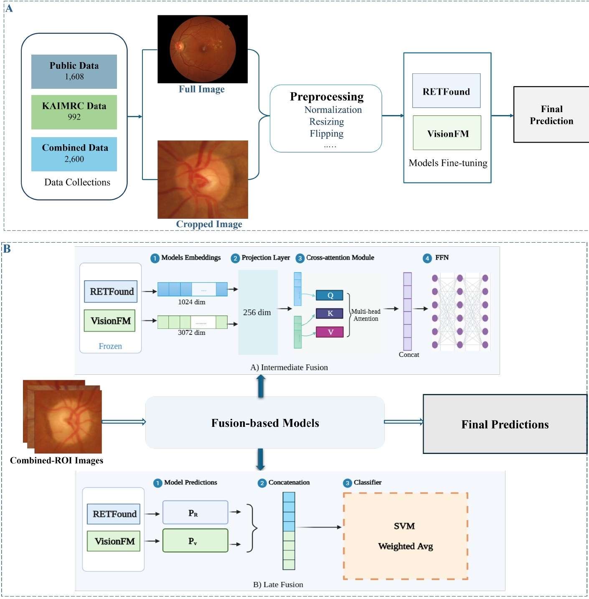

# Generalization of Retinal Foundation Models for Glaucoma Detection: A Multi-Dataset Evaluation of Cropping and Fusion Strategies

This study aims to evaluate the generalization capability of retinal foundation models (RETFound and VisioFM) for automated glaucoma detection using retinal fundus images. The study also investigates the impact of cropping and fusion strategies on model performance.

 # Overall Workflow

 <p align="center">
  
</p>

# Repository Structure

```text
├── Notebooks/      
├── Results/        
├── Weights/       
├── requirements.txt
└── README.md
```

**We provide additional descriptions in each folder that explain its corresponding files and components.**
 


# Dependencies

- To install dependencies, for the RETFound and VisionFM models, please refer to their official GitHub repositories:

https://github.com/rmaphoh/RETFound_MAE  
https://github.com/alibaba-damo-academy/VisionFM  

- For the fusion-based models, the required packages can be installed using:

```bash
pip install -r requirements.txt
```
 

# How to Run

We provide:
- Separate notebooks for the individual RETFound and VisionFM experiments
- An additional notebook for the fusion-based experiments

All notebooks are available in the [Notebooks](./Notebooks/)

 

# Model Weights

The final trained model weights are provided in the [Weights](./Weights/)


# Results

The [Results](./Results/) folder contains the final classification performance for each experiment
